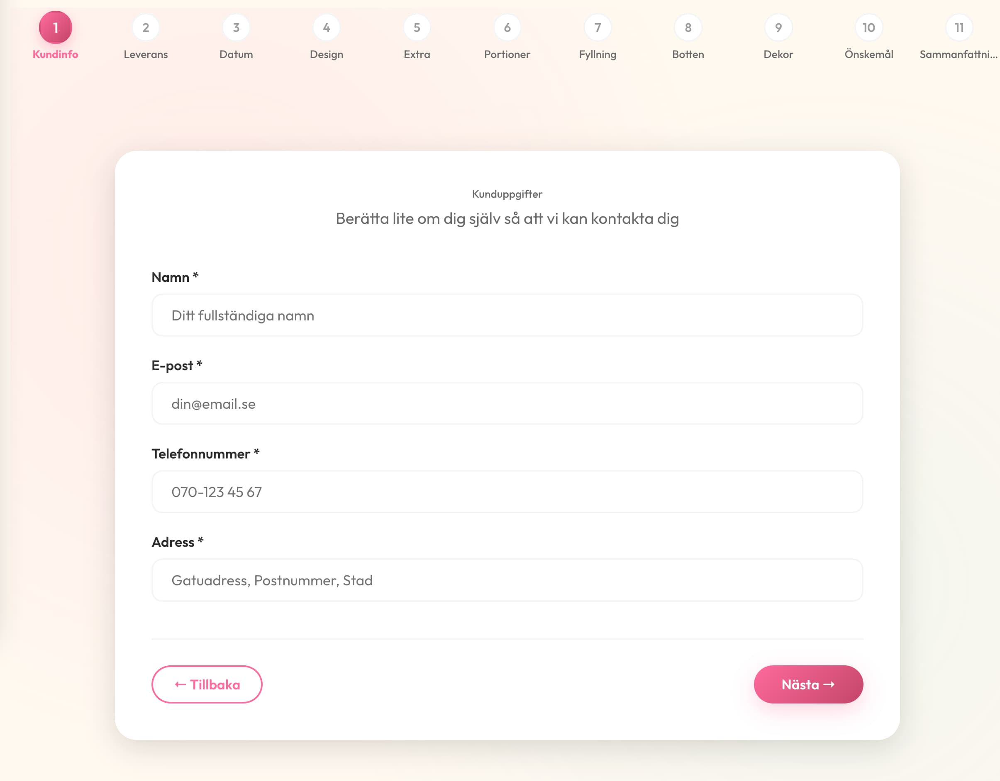
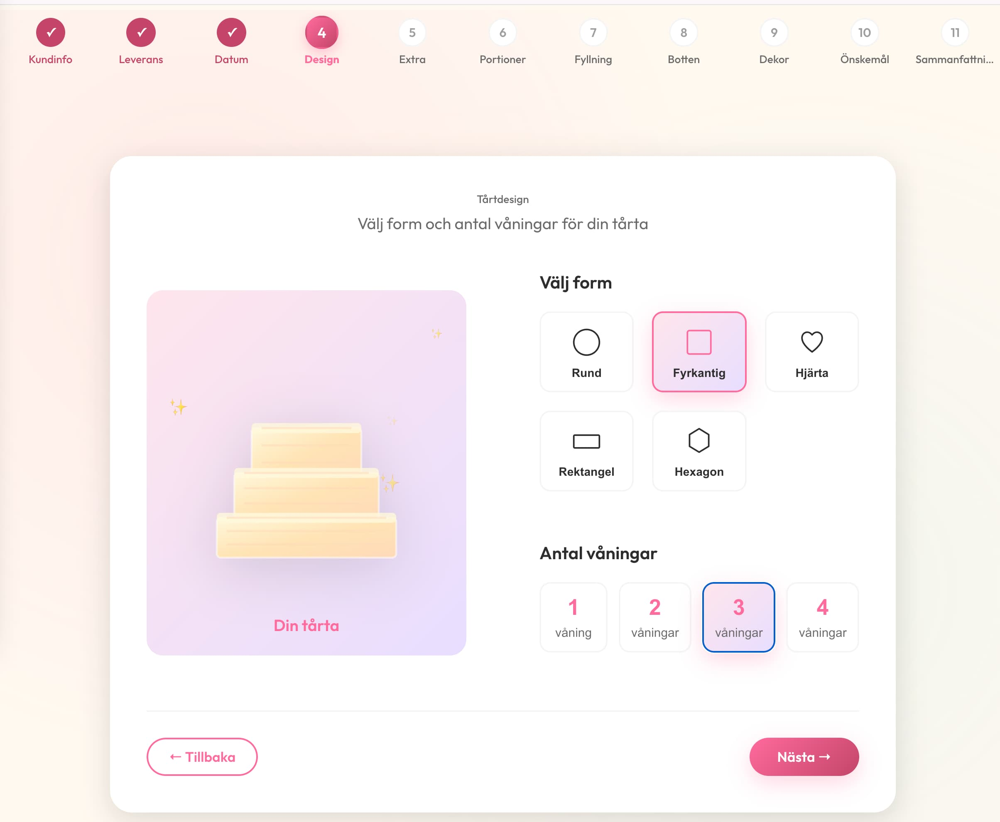
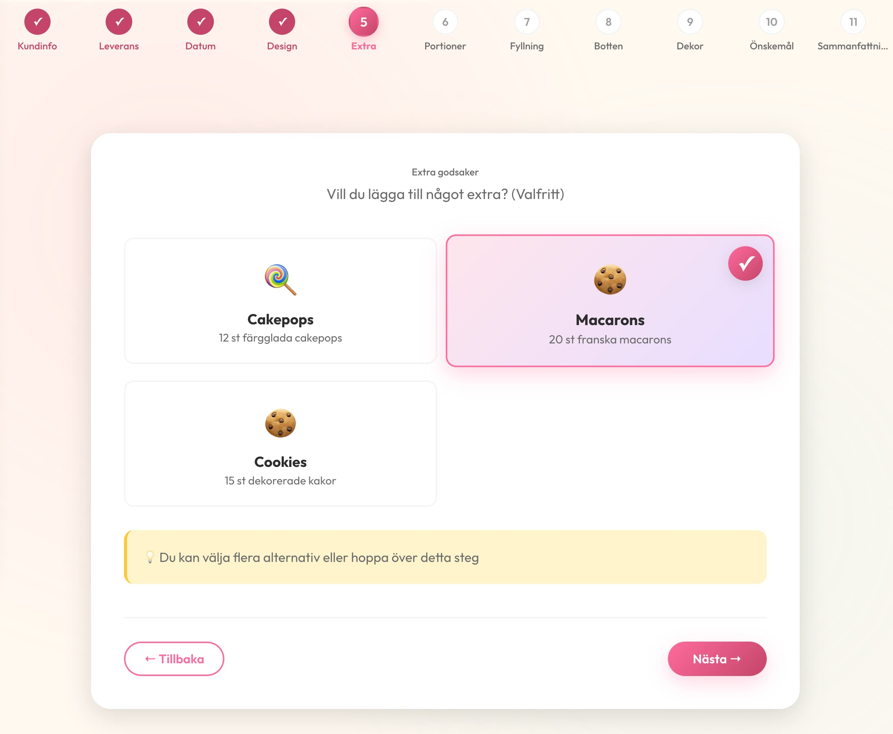
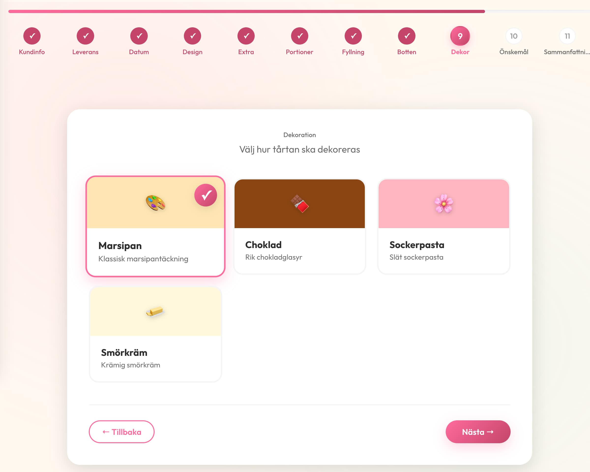
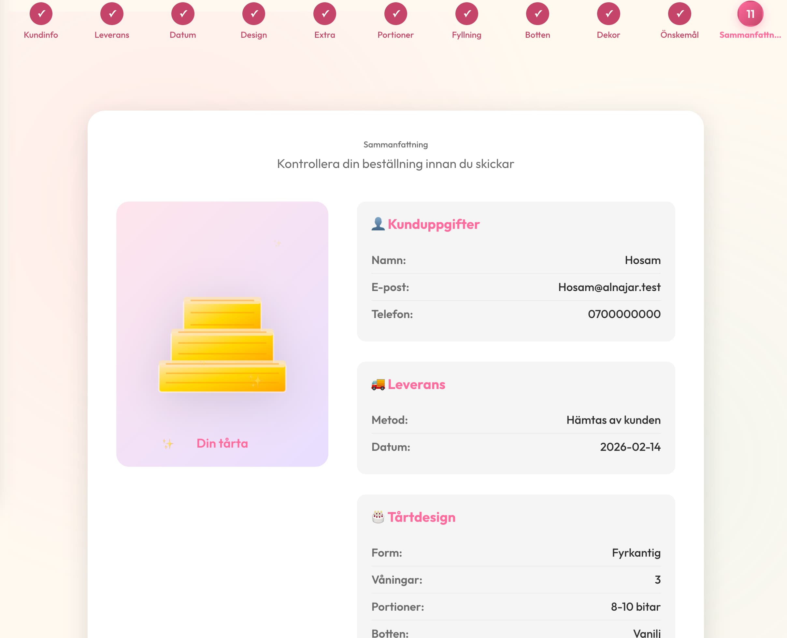
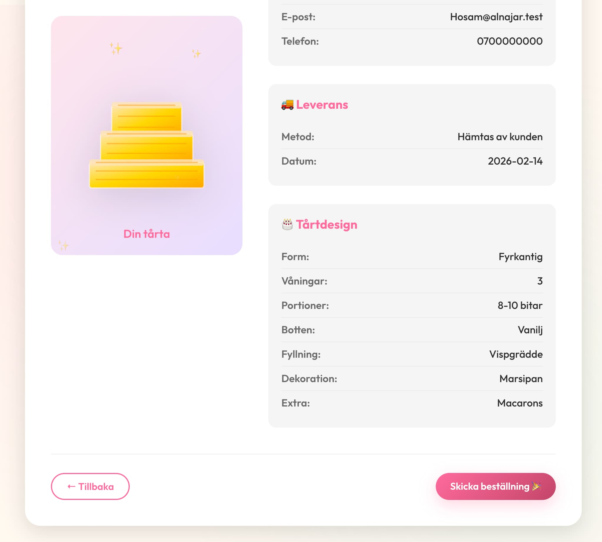

# Cake Order App
This is a cake ordering app that allows users to order cakes online.
App's language is Swedish.

# Required Technologies
- Node.js
- npm
- React
- Tailwind CSS
- Framer Motion
- Vite

# How to run the app
1. Clone the repository
2. Install dependencies: npm install
3. Run the app: npm run dev

# App Images

